# Used_car_prediction-ML<br />(중고차 가격 예측 머신러닝)

## 대경권 대학생 인공지능 프로그래밍 경진대회
- https://programmers.co.kr/competitions/581/dg-univ-2020
---
## 주어진 Data Set
- train.csv <br />
  - Data column 소개
    1. **no** : row 번호.
    2. **모델명** : 해당 튜플의 모델명.
    3. **연월** : 해당 튜플의 연월, 12/12(13년형) 이런 식으로 적힌 경우 13년형으로 봄.
    4. **연식** : 해당 차량의 제작연도
    5. **연료** : 해당 차량이 어떤 연료를 사용하는지에 대한 정보.
    6. **주행거리** : 해당 튜플의 주행했던 거리, ml 단위일 경우 km로 바꿔서 계산, 혹은 km를 ml로 바꿔도 가능.
    7. **인승** : 해당 차량이 몇 인승인지에 대한 정보.
    8. **최대출력(마력)** : 해당 차량의 최대출력(마력).
    9.  **기통** : 해당 차량이 몇 기통인가에 대한 정보.
    10. **최대토크(kgm)** : 해당 차량의 최대토크에 대한 정보.
    11. **구동방식** : 해당 차량의 구동방식에 대한 정보.
    12. **자동수동** : 해당 차량이 자동인지 수동인지에 대한 정보.
    13. **국산/수입** : 해당 차량이 국산차인지 수입차인지에 대한 정보.
    14. **신차가(만원**) : 해당 차량의 신차가 정보.
    15. **가격(만원**) : 해당 차량의 실제로 거래된 중고차 가격 정보.

    <details>
    <summary>train.csv 내용 예제</summary>

    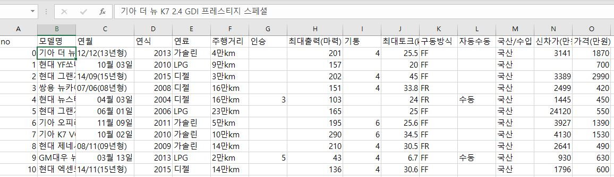

    </details>

    

- test.csv <br />
  - train.csv의 column에서 신차가(만원)과 가격(만원)을 제외한 test 해야할 정보들을 가짐.

    <details>
    <summary>test.csv 내용 예제</summary>
    
    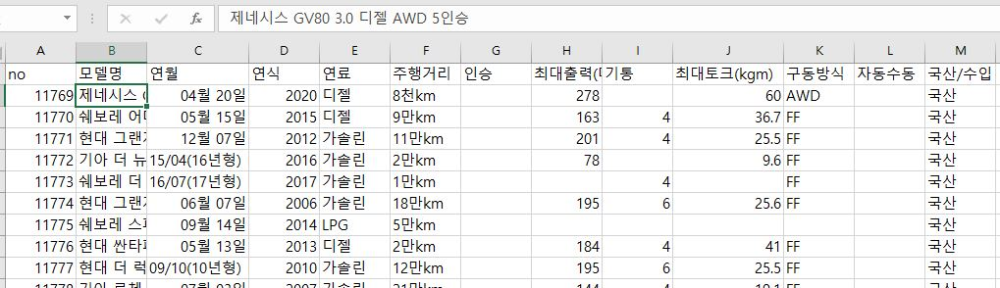

    </details>

- submission.csv <br />
  - test.csv의 no 순서대로 가격(만원)을 예측한 값을 적은 후, 제출해야 함.

    <details>
    <summary>submission.csv 내용 예제</summary>
        
    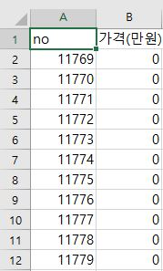

    </details>
---
## 접근 방법

- 필요한 라이브러리 불러오기
    ```python
    import numpy as np
    import pandas as pd
    import matplotlib.pyplot as plt
    import seaborn as sns
    from sklearn.preprocessing import LabelEncoder
    from sklearn.model_selection import train_test_split
    from sklearn.linear_model import LinearRegression
    from sklearn.metrics import accuracy_score, confusion_matrix, r2_score
    from sklearn.metrics import mean_absolute_error
    from sklearn import preprocessing
    from sklearn.model_selection import GridSearchCV
    from sklearn.ensemble import GradientBoostingRegressor
    from sklearn.ensemble import RandomForestClassifier
    from sklearn.ensemble import RandomForestRegressor

    import platform
    plt.rc('font',family='Malgun Gothic'
    ```

- 데이터셋 불러오기
    ```python
    # train data
    dummy_data = pd.read_csv('input/train.csv')
    # test data
    dummy_test = pd.read_csv('input/test.csv')
    ```

- 데이터셋 확인하기
  - train.csv
    ```python
    dummy_data.info()
    ```
    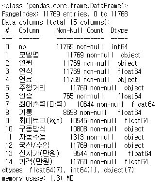

    <br />
  - test.csv
    ```python
    dummy_test.info()
    ```
    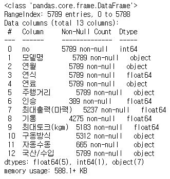

- 데이터셋 결측치(*NaN*) 확인
  - 데이터를 전처리 할 때, 가장 먼저 **NaN(결측치)를 확인하고 제거**해야한다.<br />
   만약 제거할 데이터가 수치 값이라면 NaN에 **평균값**을 넣어주는 등의 처리를 할 수도 있지만<br />
   이름, 종류 등과 같이 어떤 값으로 대체하기 어렵다면 결측치가 있는 row를 아예 **제거하기도 함.**

   - train set 결측치 확인
    ```python
    dummy_data.isnull().sum()
    # total -> 11769 
    ```
    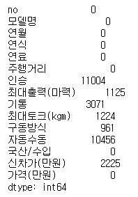 <br />
    >인승, 자동수동의 결측치가 유독 많다는 사실을 알 수 있다.

    - test set 결측치 확인
    ```python
    dummy_test.isnull().sum() 
    # total -> 5789
    ```
    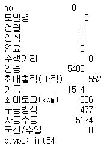 <br/>
    >마찬가지로, 인승, 자동수동의 결측치가 유독 많다는 사실을 알 수 있다.

- 데이터 전처리(*NaN*이 많은 column 제거)
    ```python
    ### 데이터 전처리
    # NaN 제거
    clean_data = dummy_data.copy(deep=True)
    clean_test = dummy_test.copy(deep=True)
    # no, 인승,자동수동, 신차가, 연월 제거
    clean_data.drop(columns=['no','인승','자동수동','신차가(만원)','연월'],inplace=True)
    clean_test.drop(columns=['no','인승','자동수동','연월'],inplace=True)

    clean_data = clean_data.reset_index(drop = True)
    clean_test = clean_test.reset_index(drop = True)
    #clean_data.shape #(11769,15) -> (11769, 10)
    #clean_test.shape #(5789,12) -> (5789, 9)
    ```
    - train set에서 결측치가 많았던 '인승', '자동수동' 외에도 'no', '신차가(만원)', '연월'을 추가적으로 제거하는 이유. 
      - 'no' 같은 경우 아무런 의미 없이 튜플들의 순서만을 나타내므로 제거함.
      - '신차가(만원)'같은 경우, test_set에서의 column에는 '신차가(만원)'항목이 없으므로, column의 종류를 맞춰주기 위해 제거함.
      - '연월'같은 경우 '연식'에서 정보를 다 나타내주며, '연월'은 문자형으로 처리하기가 까다롭지만 '연식'은 숫자로 더 편하게 정보를 조작할 수 있기때문에 제거함.

- 데이터 전처리(각각의 Column domain 확인 후 *NaN* 제거)
  - 모델명 column
    ```python
    # 차종류 수 정의
    len(np.unique(list(clean_data.모델명))) #1741

    # 차종에서 브랜드만 남기고 제거
    names = list(clean_data.모델명)
    for i in range(len(names)):
        names[i] = names[i].split(' ',1)[0]
    clean_data.모델명 = names
    #clean_data.head() # ex> 현대, 기아 ...

    # 차종에서 브랜드만 남기고 제거
    test_names = list(clean_test.모델명)
    for i in range(len(test_names)):
        test_names[i] = test_names[i].split(' ',1)[0]
    clean_test.모델명 = test_names
    #clean_test.head() # ex> 현대, 기아 ...
    len(np.unique(list(clean_data.모델명))) # 97
    #len(np.unique(list(clean_test.모델명))) # 58
    ```
    - 차의 '모델명' column을 보면, train set의 경우 domain이 총 1741개이다. 이는 오버피팅을 초래할 수 있으므로 '기아 더 뉴 K7 2.4 GDI 프레스티지 스페셜'에서 제일 앞 '회사명' 만 남기고 나머지를 제거하였다.
    - 이를 통해, train set의 '모델명'은 1741 -> 97 개의 domain을 가지게 되었으며 적절하게 피팅한것 같아 그 후 더 세부적(회사명_모델명)으로 나누지는 않았다.
    - test set도 train set과 마찬가지로 통일하게 하기 위해 '회사명'만 남기고 나머지는 제거하였다.
    
      ```python
      np.unique(list(clean_data.모델명))
      ```
      <details>
      <summary>출력</summary>

      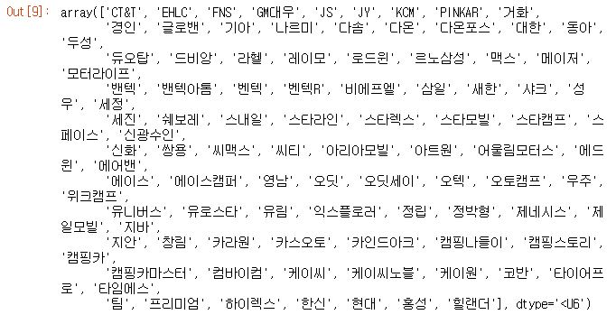

      </details>

  - 주행거리 column
    - 주행거리 column에 속하는 data들을 살펴보니 숫자와 한글로 이루어져있었다.
    - 이를 숫자로 통일하기 위해 문자열을 파싱하여 정확한 수치로 바꾼 후 data에 덮어썻다.
    - string 종류 : '만','천','등','km','ml'이 있었으며 '등'이라고 표시된 것은 정확한 기준이 없었으나 해당 튜플을 살펴보니 안좋은(즉, 가격이 낮은) 자동차라 판단하였다. 그리하여 적당하다고 판단되는 수치인 100000을 대입하였다.(이는 추후 밑에서 sns.pairplot()을 통해 나타난 데이터 분포를 바탕으로 판단했다.)
    - 'ml'의 경우 해당 대회에서 1ml = 1.609344km라고 주어졌으며, 이를 통해 km로 변환하였다.

    <details>
    <summary>train 주행거리 파싱 코드</summary>

    ```python
    #주행거리 object -> float
    clean_data.rename(columns={'가격(만원)':'가격'},inplace=True)
    distance_driven = list(clean_data.주행거리)
    distance_price = list(clean_data.가격)
    for i in range(len(names)):
        
        if '만' in distance_driven[i]:
            if 'k' in distance_driven[i]:
                distance_driven[i] = distance_driven[i][0:distance_driven[i].find('만')] + '0000'
            elif 'ml' in distance_driven[i]:
                distance_driven[i] = str(float(distance_driven[i][0:distance_driven[i].find('만')])*16093.44)
        elif '천' in distance_driven[i]:
            if 'k' in distance_driven[i]:
                distance_driven[i] = distance_driven[i][0:distance_driven[i].find('천')] + '000'
            elif 'ml' in distance_driven[i]:
                distance_driven[i] = str(float(distance_driven[i][0:distance_driven[i].find('천')])*1609.344)
        elif '등' in distance_driven[i]: # 가장 안좋은듯
            distance_driven[i] = '100'+str(i%10)+'00'
            #print(distance_driven[i])
        elif 'k' in distance_driven[i]:
            distance_driven[i] = distance_driven[i][0:distance_driven[i].find('k')]
        elif 'ml' in distance_driven[i]:
            distance_driven[i] = str(float(distance_driven[i][0:distance_driven[i].find('m')])*1.609344)
            
    clean_data.주행거리 = distance_driven
    clean_data["주행거리"] = clean_data["주행거리"].astype(float)
    #clean_data.dtypes
    ```

    </details>

  - 구동방식 column
    ```python
    clean_data['구동방식'].value_counts(dropna = False)  
    ```
    <details>
    <summary>출력</summary>

    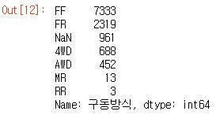

    </details>

    - 위 출력 결과를 통해 '구동방식'의 데이터 형태와 NaN을 제거해야한다는 사실을 알 수 있다.
    - NaN을 제거하기 위해서 생각한 바로는 NaN을 최빈값의 비율에따라 대체하자는 생각을 하였다.
    - 그리하여 .fillna(method='ffill')을 통해 NaN값의 바로 앞 튜플의 값으로 치환하는 방법을 사용하였다.
      ```python
      # 구동방식 NAN -> NAN 바로 앞 값으로 치환
      clean_data['구동방식'].fillna(method='ffill',inplace = True)
      clean_data.isnull().sum() 
      ```
      <details>
      <summary>출력</summary>

      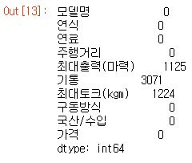

      </details>
    - 위 출력을 통해 NaN이 완전히 제거되었음을 알 수 있다.
    - 최대출력(마력)     1125 <br />
      기통           3071 <br />
      최대토크(kgm)    1224 <br />
      위 3개의 column만 NaN 처리를 하면 된다는 사실도 알 수 있다.
 
  - 최대출력(마력) column
    - '최대출력(마력)'은 NaN값을 평균값으로 치환하였다.
      ```python
        # 최대출력(마력) NAN -> 평균값 치환
        mean_age = clean_data['최대출력(마력)'].mean()
        clean_data['최대출력(마력)'].fillna(mean_age,inplace=True)
      ```
  
  - 기통 column
    ```python
    clean_data['기통'].value_counts(dropna = False)  
    ```
    <details>
    <summary>출력</summary>

    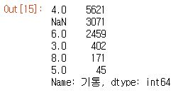

    </details>

    - 위 출력을 통해 NaN을 최빈값의 비율에 따라 대체하자고 생각하였다.
    - 그리하여 .fillna(method='ffill')을 통해 NaN값의 바로 앞 튜플의 값으로 치환하는 방법을 사용하였다.
    ```python
    clean_data['기통'].fillna(method='ffill',inplace = True)
    # 기통 NAN -> NAN 바로 앞 값으로 치환
    clean_data['기통'].value_counts(dropna = False)  
    ```

    <details>
    <summary>출력</summary>

    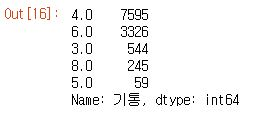

    </details>
    
  - 최대토츠(kgm)
    - '최대출력(마력)'과 마찬가지로 NaN값을 평균값으로 치환하였다.
    ```python
    # 최대토크(kgm) NAN -> 평균값 치환
    mean_age = clean_data['최대토크(kgm)'].mean()
    clean_data['최대토크(kgm)'].fillna(mean_age,inplace=True)
    ```
  
  - 최종 NaN값 확인
    ```python
      clean_data.isnull().sum()
    ```
      <details>
      <summary>출력</summary>

      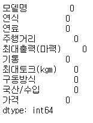

      </details>

    - 모든 column의 NaN값을 제거하였다는 사실을 알 수 있다.

- 각 column들을 카테고리별로 분류하여 데이터 프레임 재정의
  - 안의 데이터 값들을 수치화해야하므로, string으로 저장되어 있는 데이터들을 column으로 올리고 안의 데이터 값은 0 or 1로 나타낸다.
  - 코드 및 결과
    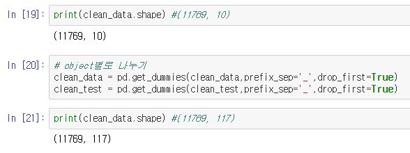

- 이상치(Outlier) 확인
  -  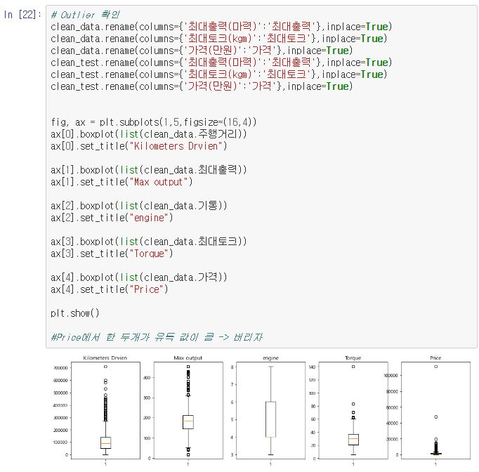
  -  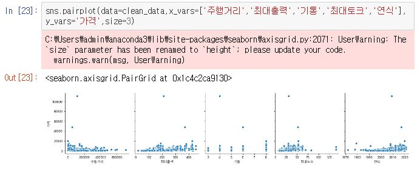
  -  각 column에서 보면 유독 2개의 값이 정상에서 벗어나므로 이를 제거합니다.
     - 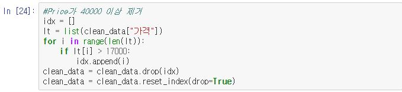
  - 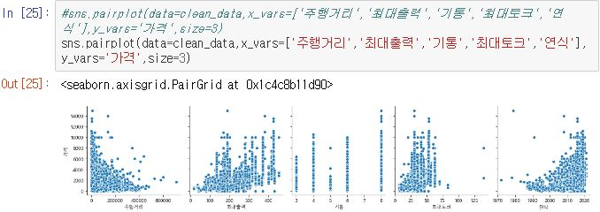
    - 튀는 outlier가 없는 그래프가 그려졌음을 확인 가능.
  
- 여기서는 train_set과 test_set을 따로 주었기 때문에, train_set에서 일부분을 때어와서 test_set을 사용하는 부분은 하지 않는다.
  - 하지만 모델명 column을 전처리하면서 train_set의 column domain 과 test_set의 column domain이 달라졌으므로 이를 통일 시켜줘야한다.
    - 그리하여 test_set의 column들만을 feature로 남기기로 했으며, "가격"을 예측해야하므로 y_train의 lable_name = "가격"을 넣어주었다.
    - 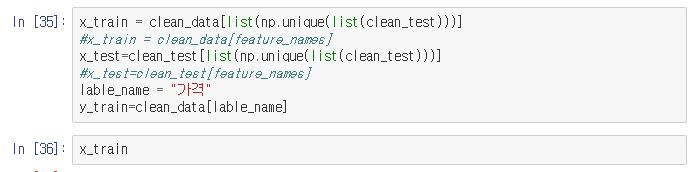
- 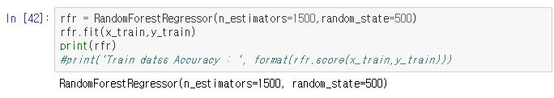
  - 그 후 앙상블의 기법 중 하나인 Random Forest 방식을 이용하여 모델을 생성하였다.
  - Random Forest의 forest는 숲, 결정 트리는 나무이다. 즉, 여러 결정트리들이 모여서 하나의 앙상블 모델을 이루는 것을 랜덤포레스트 모델이라고 한다. 결정 트리에서 컬럼(Feature)가 많아지면 오버피팅 문제가 일어난다. 이를 해결하기 위해 Feature의 갯수를 추려 작은 결정트리를 여러개로 만들어 하나로 합치는 것을 랜덤포레스트라고 한다.
    - 출처 : https://ebbnflow.tistory.com/141?category=738689
  - Column수가 많은 모델이므로 일반 다중선형회귀보다 앙상블 모델을 이용해야 정확도를 높일 수 있다.

- 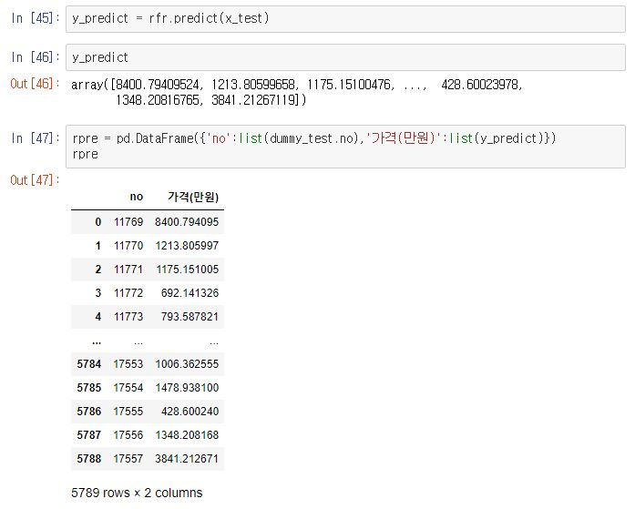
  - 예측 결과를 확인할 수 있으며 이러한 결과를 sample.csv 형식에 맞춰 넣어주었다.
- 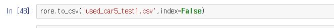
  - sample.csv에 예측 결과 입력.

---

## 대회 결과

<details>
<summary>등수</summary>

  - 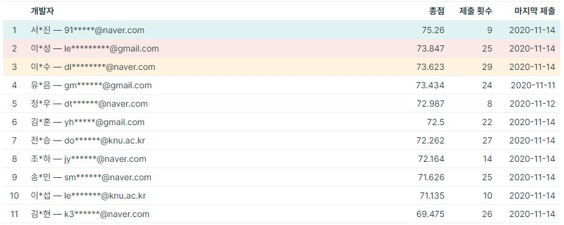
  - 69명 중 11등.
</details>

- 주관
  - 경북대학교 SW교육센터

- 참가대상
  - 지역선도대학육성사업 컨소시엄 참여 대학교 참여학과 재학생
  - 참여 대학교: 경북대학교, 계명대학교, 경운대학교, 한동대학교, 동국대학교(경주)


- 우수상
  - 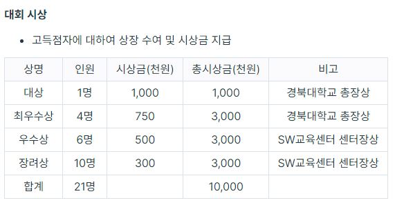
